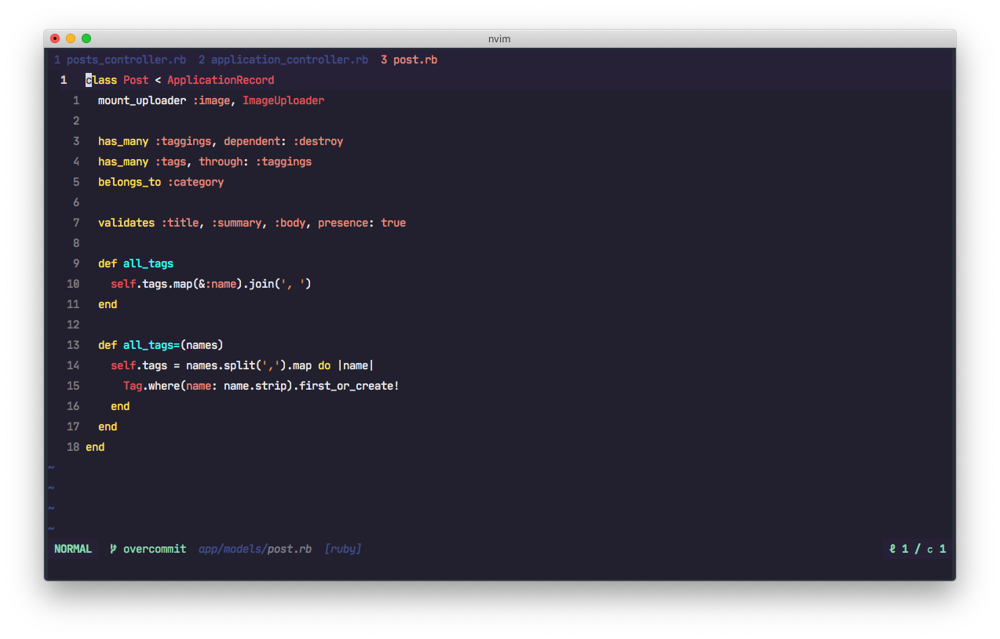
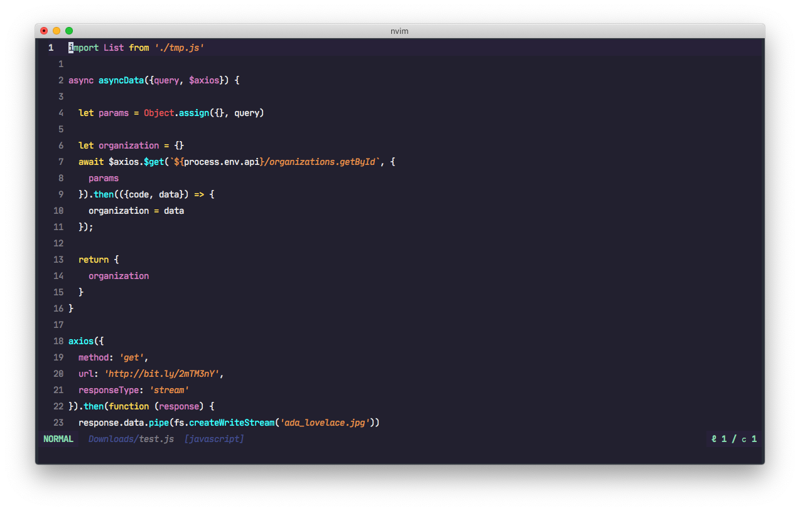
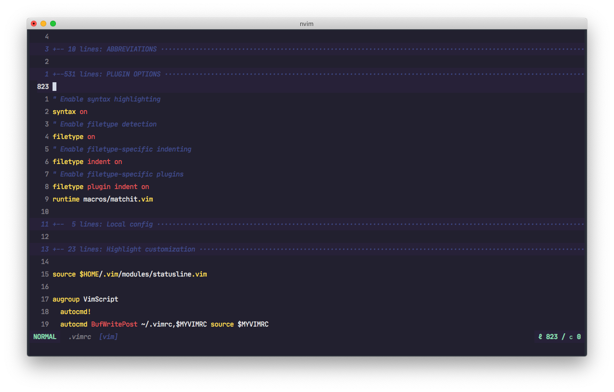

# Synthwave 84 Vim theme

The port of [SynthWave '84 - VS Code theme to Vim](https://github.com/robb0wen/synthwave-vscode)

## Screenshots

### Ruby


### JavaScript


### Vim script


# Installation

## Option 1: Manual

1. Download and move `synthwave84.vim` to the `~/.vim/colors` directory:

    ```sh
    cd vim-synthwave84/colors
    mkdir ~/.vim
    mv synthwave84.vim ~/.vim/colors/
    ```

## Option 2: vim-plug

1. Install the [vim-plug](https://github.com/junegunn/vim-plug) plugin manager.

2. Install `vim-synthwave84` using `vim-plug`:

    a. Put the following line in the `~/.vimrc` file:

      ```ini
      Plug 'artanikin/vim-synthwave84'
      ```

    b. Reload `~/.vimrc` and run `:PlugInstall` to install the plugin.

    c. Put the following line in the `~/.vimrc` file and reload `vim`:

      ```
      colorscheme synthwave84
      ```

# Troubleshooting

## Colors are Wrong

  

  This theme requires `vim` to support the 
  `+termguicolors` option.

  To check for this option run:

  ```sh
  vim --version | grep -o '+termguicolors'
   ```

  NOTE: If the option is __not__ available no output will show.

  If the option is available, add the following 
  to the `~/.vimrc` file: 
  
  ```ini
  set termguicolors
  ```

  The colors should then appear correctly after reloading `vim`:

  

  Here is a text copy of the `~/.vimrc` file shown 
  in the screenshot above:

  ```ini
  set term=xterm-256color
  "set term=screen-256color
  if has('termguicolors')
      set termguicolors
  endif

  set background=dark

  call plug#begin("~/.vim/plugged")
      Plug 'artanikin/vim-synthwave84'
  call plug#end()

  colorscheme synthwave84
  ```